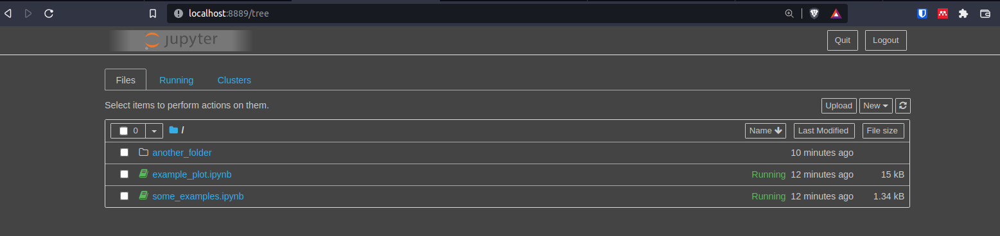
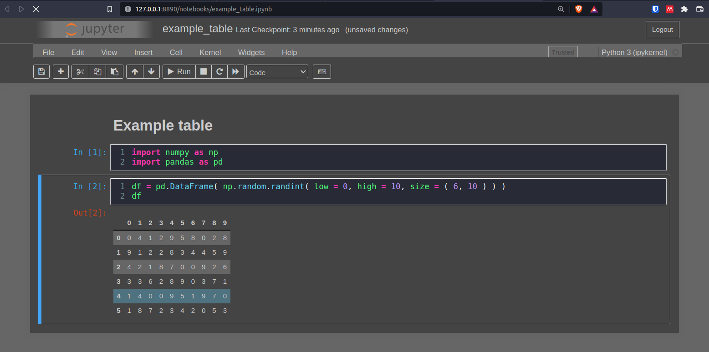

# Jupyter Notebook Dark Theme

Apply a dark theme to your Jupyter Notebooks and Index page.

## Install

1. If you don't already have one, [initialize the configuration folder for Jupyter](https://jupyter-notebook.readthedocs.io/en/stable/config.html).

2. Create a new folder called `custom` in the configuration folder.

3. Copy the `custom.css` file in this repository into the newly created `custom` folder.

## Examples

**Index page**

**Notebook**

**Table**

**Plot**

> Adapted from [Code Mirror Dracula theme](https://github.com/codemirror/CodeMirror/blob/master/theme/dracula.css).